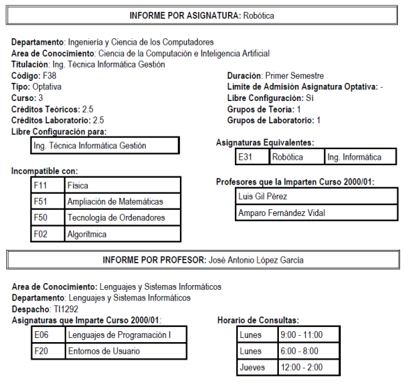

# Sistema

Desarrollar una aplicación para el servicio de estudiantes, la universidad proporciona información sobre las asignaturas de cada titulación e información sobre los profesores, mediante los tipos de informe que se muestran más adelante. Para ello, posee un fichero de asignaturas y un fichero de profesores, con los correspondientes programas que se encargan de gestionarlos y que generan dichos informes. Dados los problemas de inconsistencia de datos que el sistema de ficheros conlleva, se desea diseñar una base de datos relacional que lo sustituya. Algunas aclaraciones que el servicio de estudiantes nos ha hecho son las siguientes: en cada departamento hay varias áreas de conocimiento, cada una de las cuales imparte una serie de asignaturas distintas en una o varias titulaciones. Cada profesor pertenece a un único área de conocimiento de un departamento e imparte clases en una o varias asignaturas de ese área.

## Ejemplo

## Diagrama

